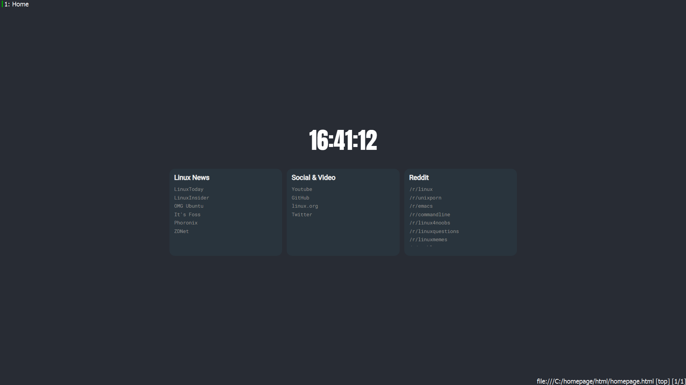
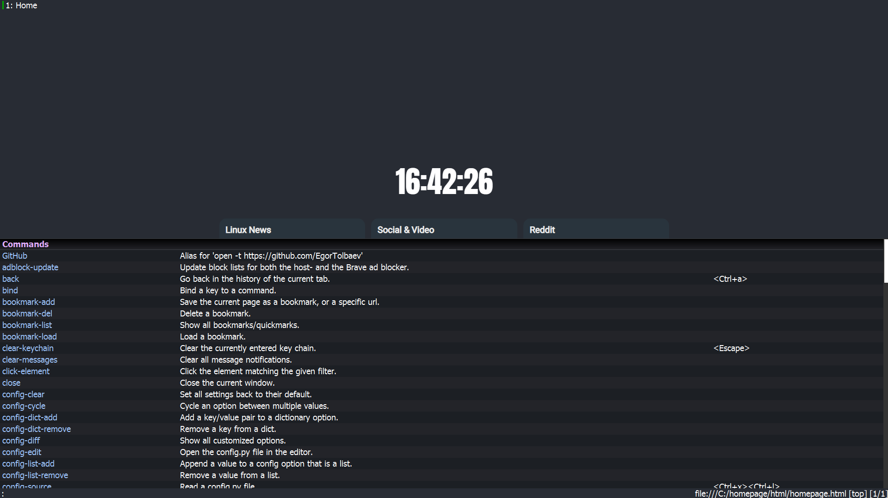

<h1 align="center">
Qutebrowser config
</h1>

<h2>

Это моя конфигурация для браузера [Qutebrowser](https://github.com/qutebrowser/qutebrowser)

</h2>

---

<h3>

Для удобства я разделил конфигурацию на несколько скриптов.  
Список файлов:

- [config.py](./config/config.py) - главный файл конфигурации qutebrowser.
- [color_theme.py](./config/color_theme.py) - настройка цветовой темы.
- [fonts.py](./config/fonts.py) - настройка шрифтов.
- [keybindings_emacs.py](./config/keybindings_emacs.py) - я использую Emacs и решил что такое же сочетание клавиш будет удобным. Если Вам это не подходит можете отключите в файле [config.py](./config/config.py).

</h3>
